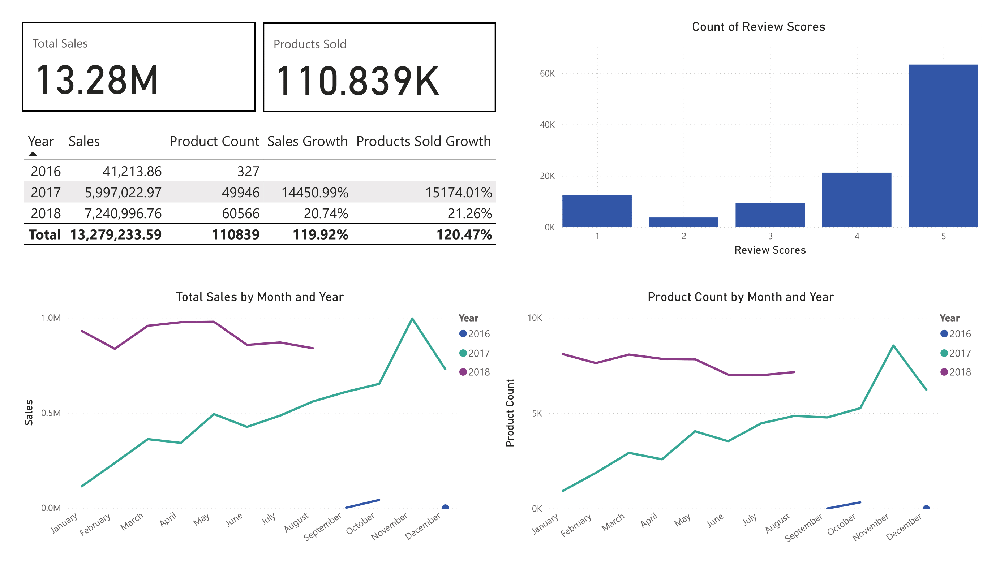
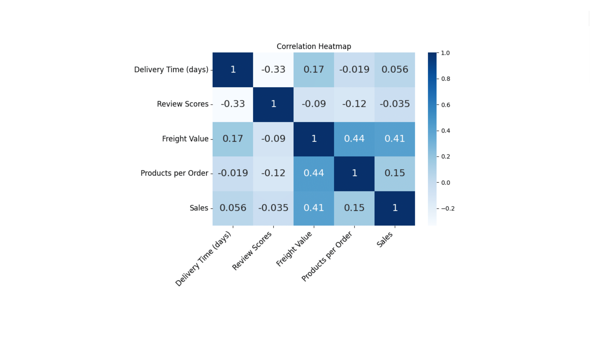
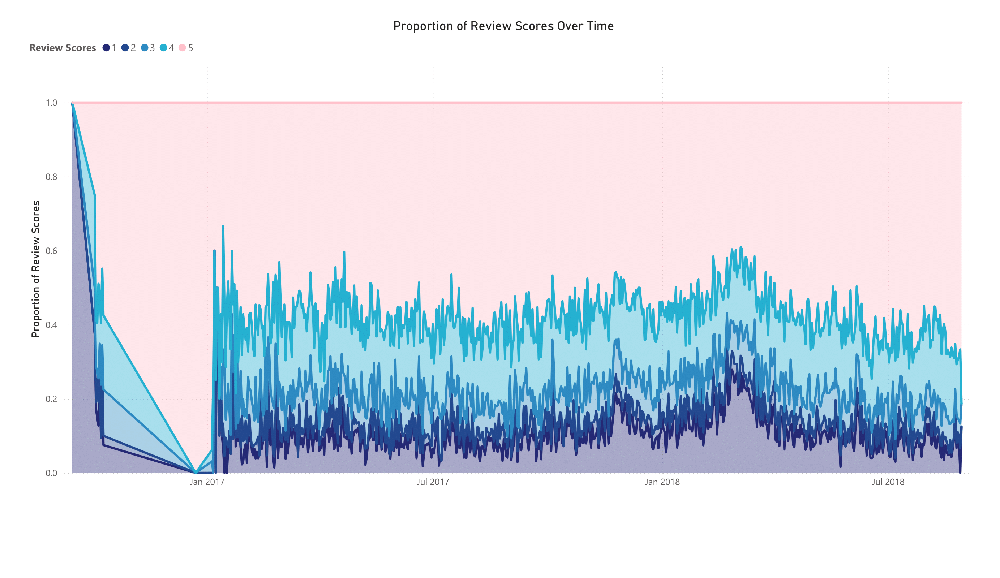
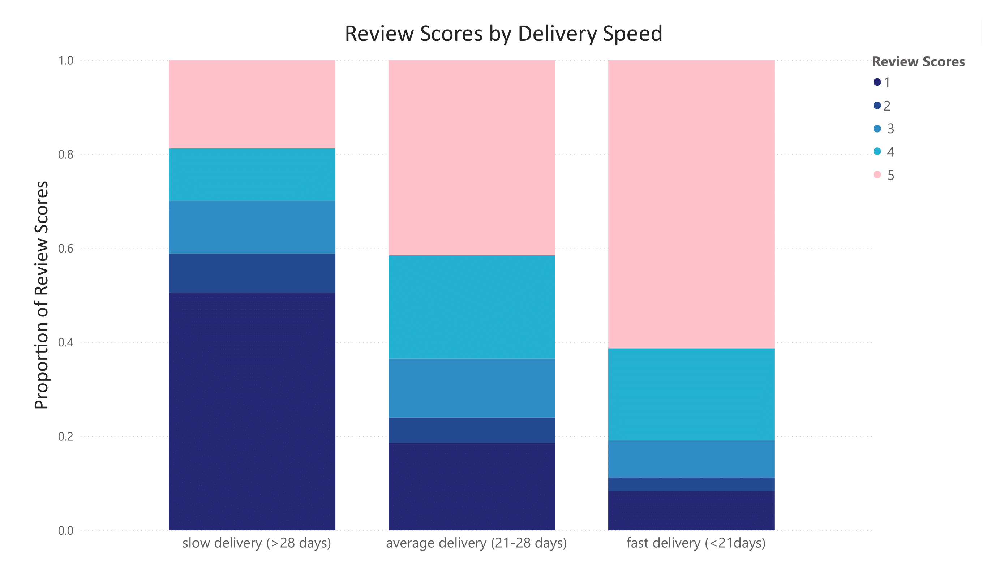
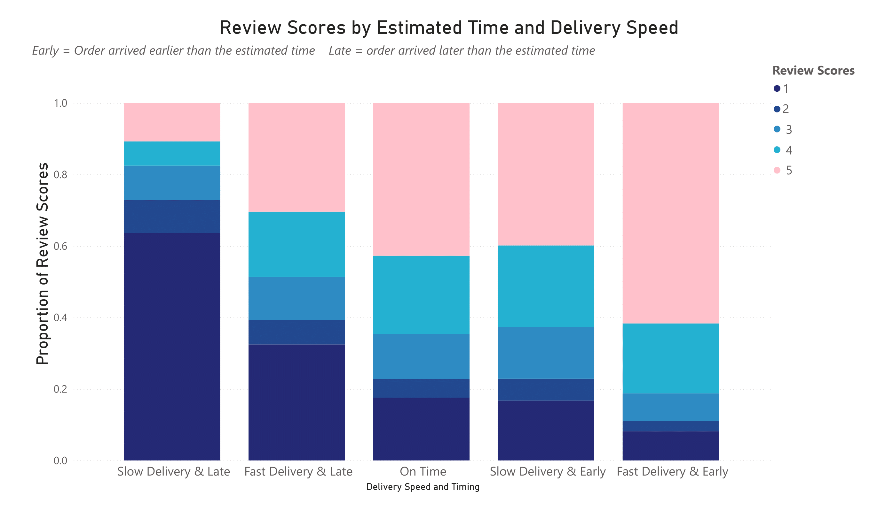

# Olist E-Commerce Sales Performance Analysis (2016-2018)

## Background and Overview

This project looks into E-Commerce data provided by [Olist store](https://www.olist.com/), the data contains information of over 110k products sold from October 2016 to August 2018 at marketplaces all over Brazil. Olist is a Brazillian E-Commerce tech startup that was established in the marketplace in 2016. Olits connects small and medium-sized sellers to major marketplaces like Mercado Livre, Amazon, and Walmart. Olist helps the Brazillian marketplace manage their business by offering Enterprise Resource Planning (ERP) software, logistics services and financial tools. In this project I will analyze the ERP data from their E-Commerce platform mainly focusing on sales, delivery time, product performance and reviews. The main goal is to look at the performance of Olist during its first few years in the marketplace to identify potential strategies and operational practices that contributed to Olist’s early success, which could inform future e-commerce business models.

### Objectives:

*Product Performance*: Identify the top-performing products and categories based on sales volume and revenue, as well as their performance across different times of the year. This insight will help Olist optimize inventory planning, tailor marketing campaigns, and anticipate seasonal demand more effectively.

*Review Scores Analysis*: Explore customer reviews to uncover patterns that influence review scores. Insights from this analysis can guide improvements in customer experience, leading to higher customer satisfaction, increased customer retention, and potentially greater sales.

*Sales Trends and Growth Rate*: Examine overall sales trends and growth rates over time to reveal reveal whether growth during the early years was consistent and sustainable. This will provide data to identify reasons for early success and provide a clear view of Olist’s business trajectory and highlight any seasonal patterns.

## Executive Summary

*Olist Trends and Growth Rate:*

 Olist sales analysis of orders from October 2016 to August 2018 shows a huge increase in sales from 2016 to 2017 with a growth of over 14000%. The company's first official release in the main market place was estbalished in 2016. The marketing and overall usefullness of the services provided must have gained a lot of popularity when released, this may indicate a well-executed market entry strategy, and effective exploitation of an untapped market opportunity. From 2017 to 2018 the company had a growth rate in sales of 20%, indicating a more steady growth rate as the company is now established and well known, huge growth spikes are less likely after being tapped into the market. With that being said the current growth rate from Jan 2018 to Aug 2018 is -0.05% indicating negligible growth or decline in sales.

*Product Performance:*

The five products with the most sales are: 1. Beauty & Health (9.4% of total sales), 2. Watches(8.9% of total sales), 3. Bed, Bath and Table (7.9% of total sales), 4. Sports & Leisure (7.3% of total sales), 5. Computer & Accessroies (6.8% of total sales). All products sold had very small fluctuations in percentage sales contribution over time and no biases towards time of year. Two other notable product categories are Home Décor & Furniture and Household Items which have a lot of products sold (more than Watches) but have lower sales as the prices of these items are low. Focusing on expanding and optimizing production of these popular products is important to ensure sales and consumers increase without efficiently.

*Review Scores Analysis:*

 Reviews scores overall are high with a median of 5/5 and mean of 4.1, these scores are stable and remain around the same from 2016-2018. There is a moderate correlation between delivery time and customer reviews, indicating that a longer delivery time of orders may cause products to be negatively reviewed. When products arrive later than the provided estimated time of delivery the reviews scores get effected negatively and when the products arrive earlier than estimated time of delivery the review score are effected positively. Improving and managing deliveries more effectively will stregnthen Olist's market position and drive sustainable growth.

## Data Structure Overview

The data chosen from Olist orders database represents sales information, transaction dates, customer reviews, and product information from October 2016 to August 2018.

### Sales data: 
Data contains price of products and freight values of every product bought. Each unique record contains an order id that is repeated based on how many products are bought per order and a product id to identify each unique product. This data helps us to evaluate how many items are bought per order and which products bring in the most sales. 

### Transaction dates: 
The records contains a unique order id, the purchase time of each order, the estimated delivery time, date the order was recieved by the carier and the date the product was received by the customer. This data can be used to find how long it takes products to reach the customers and how this may effect reviews of the products. The date of purchase is also used to find any trends regarding specific products bought based on time of the year.

### Customer Reviews:
Reference table that includes order id and customer review score for each product. The review scores are an indication of customer satisfaction, these scores can be used to investigate the product rating and find correlations for low and high review scores. This allows us to find ways to improve services for better customer satistfaction and retention.

### Product Category:
Reference table that includes unique product id and product category name. Contains the category name of the product to give more meaning and information to products.

## Insights Deep Dive

### Sales Trends:

* Olist averages R$4.4 million in annual sales and nearly 37000 orders per year

* The average sales per month is R$577K and the average sales growth rate is 46000%

* Total sales per month in 2016 and 2017 shows an increasing trend over time, while in 2018 there is no clear trend.  

* There are no clear trends in terms of seasonality, potentially due to the surge in initial growth rate. Once the growth rate stabilises as seen in 2018, seasonality trends may appear. 

* Sales show huge growth rates in the first few months when the Olist E-Commerce marketplace first launched in October 2016. This surge in growth rate was followed by a steady growth rate in 2017 and staganant growth in 2018. The stagnation in growth suggests that Olist may have captured most of the addressable market available to it by 2018, supporting the reasons for a large growth rate early on. However, additional data including competitor performance and customer acquisition trends would be needed to confirm whether Olist's success is due to effective exploitation of an untapped market.

### Product Performance:

* Overall, Beauty and Health had the highest amount of sales at R$1.2 million and contributed to 9.3% of total sales with nearly 10000 products sold.

* Bed, Bath & Table had the highest amount of products sold with over 11000, over R$1 million in sales and contributed to 7.9% of total sales. 

*Other product categories with high contribution to sales were Watches at 8.9% and Sports & Leisure at 7.3%, there are a total of 72 unique product categories.

* Other products have less than 7% contribution with most having less than 1% contribution to total sales. All products sold had very small fluctuations in percentage sales contribution over time, showcasing similar contributions to sales by year and month with no biases towards time of year. 

* In 2016 Home Décor & Furniture was the most sold at 69 and had the highest sales (R$5817), during 2017 Bed, Bath & Tablehad the most products sold at 5252 as well as the highest sales(R$501,166). Finally, in 2018 up to August, Beauty & Health had the most sold at 5858 and the highest sales (R$757,111). 
 
* The most popular products for sales and number of products sold are Beauty & Health, Bed, Bath & Table, Computer & Accessories, Home Decor & Furniture, Sports & Leisure, Watches & Gifts and Household items. These seven categories are consistently in the top sales and products sold with no trends in terms of time of year.
 

### Review Score Analysis:

* The average review score is 4.1 out of a maximum score of 5, median of 5 and standard deviation of 1.35 showcasing a relatively normal distribution with most products having a high review score of 4 to 5, with more than 50% of review scores being 5. 

* The mean review score for each year individually was between 3.9 and 4.1 while the median review score was 5 every year. 

* As mentioned earlier delivery time effects review scores negatively, with a pearson's correlation coefficient of -0.33, indicating lower reviews for longer delivery times.

* Olist provides an estimated delivery time to customers for every product, the mean estimated delivery time is 24 days, when the delivery time takes more than 28 days (upper quartile of estimated delivery time) to arrive the median review score is 1 and the mean 2. Whereas when the delivery takes less than 18 days (lower quartile of estimated delivery time) to arrive which is 81% of orders, the median score is 5. 
 
* When filtering for deliveries that are considered fast (arrives in less than 18 days) but is later than the estimated time the median and mean reviews score drop to 3,  And vice versa when products come sooner than estimated, despite having a 'long' delivery time (>28 days), the median review score is higher at 4 instead of 1. 
 
* The overall results indicates that not only do late deliveries affect reviews but differences in estimated times can affect customer reviews of products.

## Recommendations

*1. Monitor sales trends and growth rate closely*

Currently Olist is out of its honeymoon period and has stopped showings signs of growth. Closely monitoring products trends by season will be easier now as Olist appears to not have anymore large increases in the customer base.

*2. Expanding clients*

Olist is mainly focused on small and medium-sized sellers in Brazil. Expanding outside of Brazil and getting international clients is an option, as growth appears to have stabilized, managing operations and getting funds will be simpler.

*3. Focus on popular products*

Ensure Beauty & Health, Bed, Bath & Table, Computer & Accessories, Home Decor & Furniture, Sports & Leisure, Watches & Gifts and Household items have increased production and quality assurance in preparation for following year. These products are high in demand from customers so ensuring quality and stock availability is very important for customer retention, customer satisfaction and growth in sales.

*4. Improve Delivery time and estimates*

Making deliveries faster is easier said than done, it will directly improve customer satisfaction but there are many variables that effect delivery speed. Focusing on ensuring estimated times are as accurate as possible is more feasible. Ensure operations for delivery estimation time are as accurate as possible, and prioritize estimation time being off by esimating arrival of products to be later. This can help ensure that deliveries never arrive later than the estimated time.

As mentioned above, even when orders come early if the product arrived after the delivery time reviews score dropped. Hence, it is important to ensure product does not arrive after estimated time. Focusing on adjusting estimated times accordingly can bring up reviews scores, customer satisfaction and potentially higher customer retention and sales. 

## Technical Details

* Downloaded the data in csv format then created tables in PostgresSQL to import data. [PostgresSQL table creation](creating_tables.sql)

* Once data is inserted into the PostgresSQL tables, the relevant tables are joined. [inserting data shell script](insert_data.sh) [Joining tables](joins.sql)

* Once joining all the relevant data into a single table, the table is exported as a csv [exporting main csv file](export_to_csv.sql)

* The csv file is imported into Jupyter Notebook where Python Pandas library is used for data cleaning. [Data cleaning](E-Commerce_data_cleaning.ipynb)

* Once data is cleaned, export the data into a different csv file keeping the raw uncleaned data file unchanged. The new cleaned file is used for analysis.

* Import newly cleaned data into Jupyter Notebook for analysis and rough data visualisations using Python and libraries such as Pandas, Numpy and Matplotlib. 

* Created tables with refined data that are then exportedinto excel files to be used in PowerBI for final data visualisations.

##  Assumptions and Caveats

1. Removed null values from customer delivery date, as these orders may not have been delivered or data is corrupted.

2. Kept orders that were cancelled as there was no null values in the data, only 7 orders were cancelled so it shouldn't effect the data.

3. Used 18 days as fast deliveries as the that is the lower quartile of estimated delivery time, 28 days for slow deliveries as that is the upper quartile, and used the time in between the two for average delivery time. 

4. For the analysis on delivery time, estimated delivery time and reviews scores. The difference in average delivery time between earlier than estimated and later than estimated delivery times for deliveries that arrived "fast" (< 18 days) and slow (>28 days), the orders that arrived earlier than estimated had lower average delivery time and vice versa for orders that come later than estimated (have longer delivery times), which could effect the reviews score.

   The average delivery time of the orders that came later than estimated time were taken and used as a benchmark. Only looking at the reviews scores of the earlier than estimated deliveries that had a higher delivery time than the average  of the later than estimated deliveries to ensure overall time taken for the delivery is not effecting the reviews scores.

   After checking for both the fast and slow deliveries, the median reviews scores were the same when taking into account pure delivery time. So the correlation still stands, that estimated time effects reviews score even when keeping pure  delviery time consistent. In the data and graphs I did not filter out the differences in delivery time but it is true that when delivery times come ealier than estimated average delivery time is lower vice versa for orders that come later than estimated.

   Just for clarificaion as this thought may have come into mind when reading the report. The reported median scores are the same even when taking into account differences in delivery time in the estimated time groups. 

