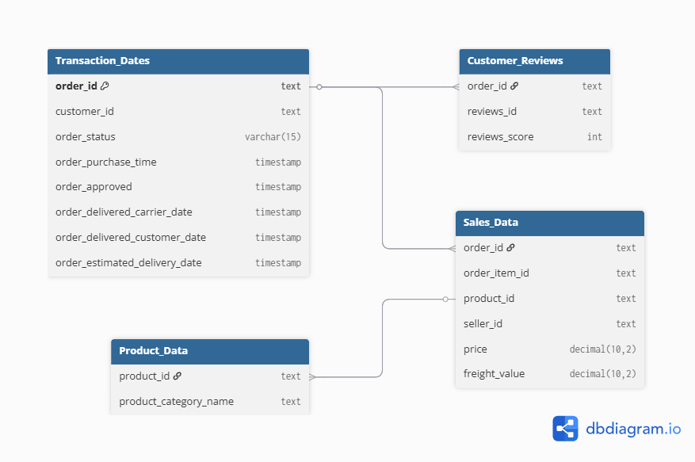
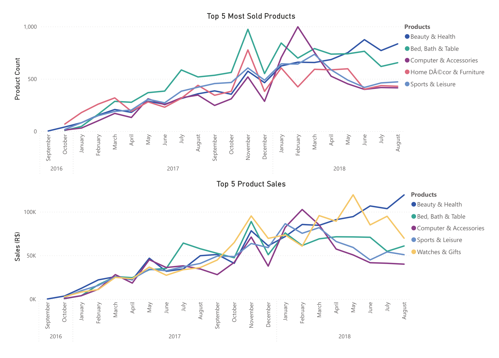
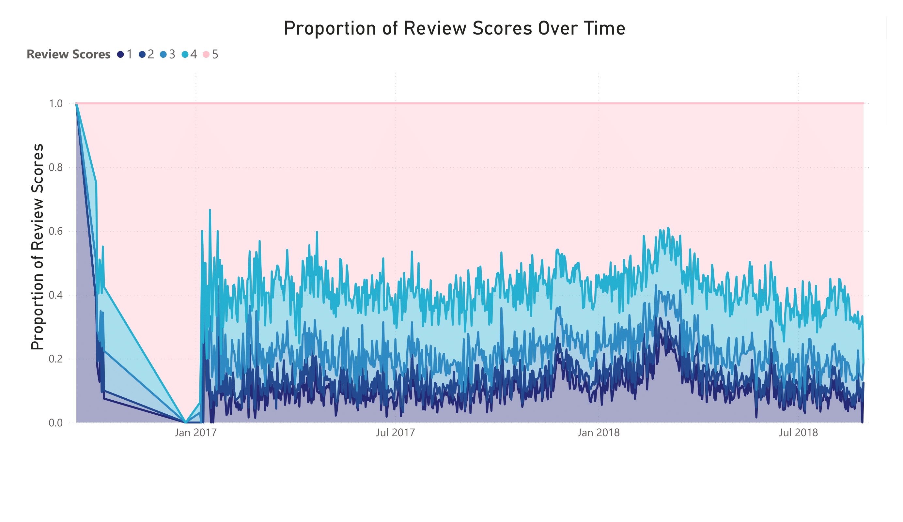

# Olist E-Commerce Sales Performance Analysis (2016-2018)

## Background and Overview

This project looks into E-Commerce data provided by [Olist store](https://www.olist.com/), the data contains information of over 110k products sold from 2016 to 2018 at marketplaces all over Brazil. Olist is a Brazillian E-Commerce tech startup that was established in the marketplace in 2016. Olits connects small and medium-sized sellers to major marketplaces like Mercado Livre, Amazon, and Walmart. Olist helps the Brazillian marketplace manage their business by offering Enterprise Resource Planning (ERP) software, logistics services and financial tools. In this project I will analyze the ERP data from their E-Commerce platform mainly focusing on sales, delivery time, product performance and reviews. The main goal is to look at the performance of Olist during its first few years in the marketplace to identify potential strategies and operational practices that contributed to Olist’s early success, which could inform future e-commerce business models.

### Objectives:

*Product Performance*: Identify the top-performing products and categories based on sales volume and revenue, as well as their performance across different times of the year. This insight will help Olist optimize inventory planning, tailor marketing campaigns, and anticipate seasonal demand more effectively.

*Review Scores Analysis*: Explore customer reviews to uncover patterns that influence review scores. Insights from this analysis can guide improvements in customer experience, leading to higher satisfaction, increased retention, and potentially greater sales.

*Sales Trends and Growth Rate*: Examine overall sales trends and growth rate over time. This will provide a clear view of Olist’s business trajectory, highlight seasonal patterns, and reveal whether growth during the early years was consistent and sustainable.

## Executive Summary

*Olist Trends and Growth Rate:*

 Olist sales analysis of orders from October 2016 to August 2018 shows a huge increase in sales from 2016 to 2017 with a growth of over 14000% as the company's first official release in the main market place was estbalished in 2016. The marketing and overall usefullness of the services provided must have gained a lot of popularity during the short period between October 2016 and January 2017, an analysis with a focus on the marketing of the company is out of the scope of this project but would be useful in the future. From 2017 to 2018 the company had a growth rate in sales of 20%, indicating a more steady growth rate as the company is now established and well known, huge growth spikes are less likely after being tapped into the market. With that being said the current growth rate from Jan 2018 to Aug 2018 is -0.05% indicating negligible growth or decline in sales.

*Product Performance:*

The top product categories in sales in 2016 were Home Décor & Furniture, Perfumes and Beauty & Health	while the product categories with the highest number of items ordered were the same. The top product categories in sales in 2017 and 2018 were Bed, Bath & Table, Beauty & Health and Watches. The product categories with the highest number of items ordered in 2017 were Bed, Bath & Table, Home Décor & Furniture and Sports & Leisure and in 2018 it was Beauty & Health, Bed, Bath & Table and Computer Accessories. All products sold had very small fluctuations in percentage sales contribution over time as well as no biases towards time of year.

*Review Scores Analysis:*

 Reviews scores overall are high with a median of 5/5 and mean of 4.1, when analysed by year there are no differences in median and very small differences in mean scores. There is a moderate correlation between delivery time and customer reviews, indicating that a longer delivery time of orders may cause products to be negatively reviewed. When products arrive later than estimated the reviews scores get effected negatively and when the products arrive earlier than estimated the review score are effected positively. For a more in depth discussion please have a look at the insights deep dive section.

## Data Structure Overview

The data chosen from Olist orders database represents sales information, transaction dates, customer reviews, and product information from October 2016 to August 2018.

### Sales data: 
Data contains price of products and freight values of every product bought. Each unique record contains an order id that is repeated based on how many products are bought per order and a product id to identify each unique product. This data helps us to evaluate how many items are bought per order and which products bring in the most sales. 

### Transaction dates: 
The records contains a unique order id, the purchase time of each order, the estimated delivery time, date the order was recieved by the carier and the date the product was received by the customer. This data can be used to find how long it takes products to reach the customers and how this may effect reviews of the products. The date of purchase is also used to find any trends regarding specific products bought based on time of the year.

### Customer Reviews:
Reference table that includes order id and customer review score for each product. The review scores are an indication of customer satisfaction, these scores can be used to investigate the product rating and find correlations for low and high review scores. This allows us to find ways to improve services for better customer satistfaction and retention.

### Product Category:
Reference table that includes unique product id and product category name. Contains the category name of the product to give more meaning and information to products.

## Insights Deep Dive

### Sales Trends:

* Olist averages R$4.4 million in annual sales and nearly 37000 orders per year

* The average sales per month is R$577K and the average sales growth rate is 46000%

* Total sales per month in 2016 and 2017 shows an increasing trend over time, while in 2018 there is no clear trend.  

* There are no clear trends in terms of seasonality, potentially due to the surge in growth rate, once the growth rate stabilises as seen in 2018, seasonality trends may appear.

* Sales show huge growth rates in the first few months when the Olist E-Commerce marketplace first launched in October 2016, this may indicate a well-executed market entry strategy, and effective exploitation of an untapped market opportunity. This surge in growth rate was followed by a steady growth rate in 2017 and staganant growth in 2018. The stagnation in growth suggests that Olist may have captured most of the addressable market available to it by 2018, supporting the reasons for a large growth rate early on. However, additional data including competitor performance and customer acquisition trends would be needed to confirm whether Olist's success is due to effective exploitation of an untapped market.

 

### Product Performance:

* Overall, Beauty and Health had the highest amount of sales at R$1.2 million and contributed to 9.3% of total sales with nearly 10000 products sold. While the most sold product category is Bed, Bath & Table with over 11000 products sold, over R$1 million in sales and contributed to 7.9% of total sales. Other product categories with high contribution to sales were Watches at 8.9% and Sports & Leisure at 7.4%, there are a total of 72 unique product categories.

* Other products have less than 7% contribution with most of having less than 1% contribution to total sales. All products sold had very small fluctuations in percentage sales contribution over time, showcasing similar contributions to sales by year and month with no biases towards time of year. 

* In 2016 Home Décor & Furniture was the most sold at 69 and had the highest sales (R$5817), during 2017 Bed, Bath & Tablehad the most products sold at 5252 as well as the highest sales(R$501,166). Finally, in 2018 up to August, Beauty & Health had the most sold at 5858 and the highest sales (R$757,111). 
 
* The product categories with the most sales in 2016 were Home Décor & Furniture, Perfumes and Toys, in 2017 and 2018 it was Bed, Bath & Table, Beauty & Health and Watches. The product categories with the most products sold in 2016 were Home Décor & Furniture, Beauty & Health and Perfumes, in 2017 it was Bed, Bath & Table, Home Décor & Furniture and Sports & Leisure, in 2018 it was Beauty & Health, Bed, Bath & Table and Computer Accessories.

* Overall Bed, Bath & Table, Beauty & Health, Sports & Leisure, Watches and Computer Accessories had the most sold from October 2016 to August 2018. 
 
* Beauty & Health has the highest overall percentage sales contribution at 9.3% out of 72 unique product categories, with Watches at 8.9%, Bed, Bath & Table at 7.9% and Sports & Leisure at 7.4%. 
 

### Review Score Analysis:

* The average review score is 4.1 out of a maximum score of 5, median of 5 and standard deviation of 1.35 showcasing a relatively normal distribution with most products having a high review score of 4 to 5, with more than 50% of review scores being 5. 

* The mean review score for each year individually was between 3.9 and 4.1 while the median review score was 5 every year. 

* As mentioned earlier delivery time effects review scores negatively, with a pearson's correlation coefficient of -0.33, indicating lower reviews for longer delivery times.

* The mean estimated delivery time is 24 days, when the delivery time takes more than 28 days to arrive the median review score is 1 and the mean 2. Whereas when the delivery takes less than 21 days (lower quartile of average delivery time) to arrive which is 87% of orders, the median score is 5. 
 
* When filtering for deliveries that are considered fast (arrives in less than 21 days) but is later than the estimated time the median and mean reviews score drop to 3,  And vice versa when products come sooner than estimated, despite having a 'long' delivery time (>28 days), the median review scores are higher at 4 instead of 1. 
 
* The overall results indicates that not only do late deliveries affect reviews but differences in estimated times can affect customer reviews of products.

## Recommendations

